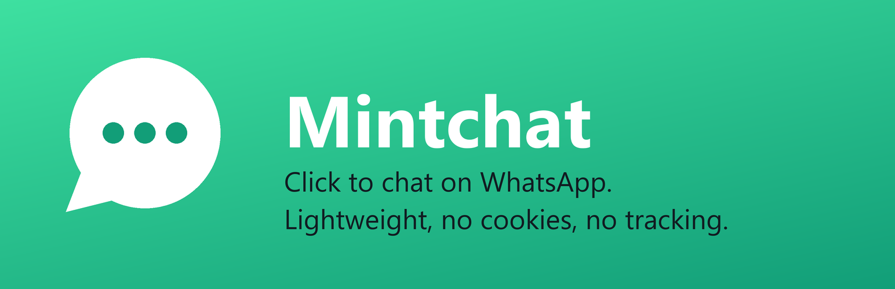
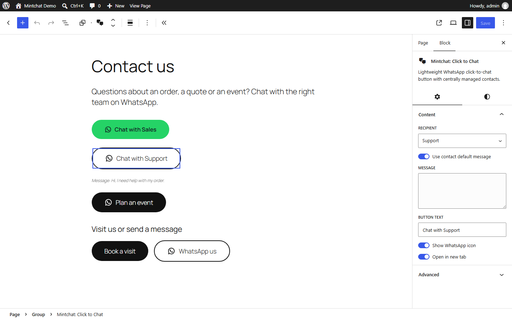
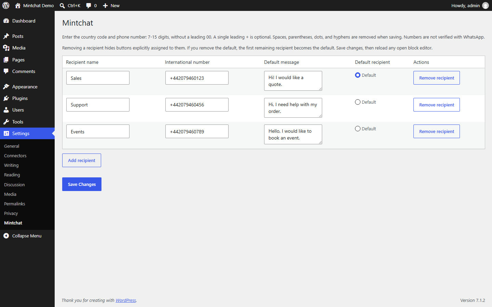
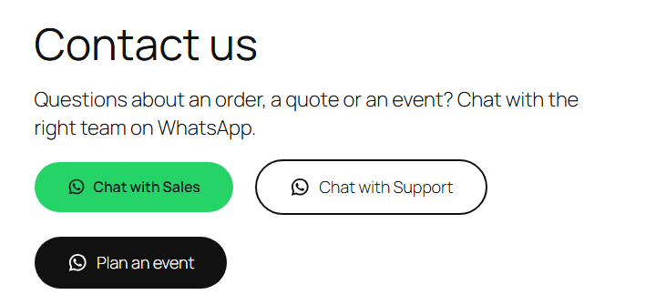

<p align="center">
  
</p>

<p align="center">
  <br>
  <strong>Mintchat: Click to Chat</strong><br>
  A native WordPress block that opens a WhatsApp chat with the right contact and a pre-filled message.<br>
  No JavaScript, no cookies, no tracking.
</p>

<p align="center">
  
  
  
  
  
</p>

---

Configure your contacts once (Sales, Support, Bookings...), then drop a button wherever you want it. Each button picks a contact and a message. Change a number in one place and every button follows, without resaving a single post.

The button is a plain `https://wa.me/` link. Nothing loads, runs or gets stored in the browser until the visitor decides to click.

## Screenshots

| Block editor | Contacts |
| --- | --- |
|  |  |

| Fill, Outline and Theme styles | Inside a Buttons block |
| --- | --- |
|  |  |

## Features

- **A block, not a widget.** Place it in content, headers, footers or next to other buttons in a core Buttons block. No floating bubble.
- **Central contacts.** Several contacts with names, numbers and default messages, plus a site-wide default.
- **The right message.** Per button: the contact's default message or a custom one. Per page: an override in the document sidebar, on any post type with custom fields.
- **Three styles.** Fill (WhatsApp green), Outline and Theme (your theme's own button look).
- **All the native design tools.** Color, typography with letter spacing and uppercase, spacing, border, radius, shadow and alignment.
- **Safe by default.** Missing or deleted contacts hide the button instead of linking to a wrong number. Output is escaped, new tabs get `rel="noopener noreferrer"`.
- **Ready for AI agents.** Two abilities on the WordPress Abilities API: `mintchat/list-contacts` and `mintchat/add-chat-button`. See [AI agents](#ai-agents).
- **Clean uninstall.** Removes its option and the per-page messages, leaves your content untouched.

## How light is it

Measured on WordPress 7.1 with Twenty Twenty-Five:

| | Size |
| --- | --- |
| Frontend JavaScript | **0 bytes** |
| Frontend requests | **0** (WordPress inlines the stylesheet; block themes add it only to pages that use the block) |
| Stylesheet, icon included | 2.6 KB, 1.1 KB gzipped, once per page |
| Markup per button | about 500 bytes, 0.3 KB gzipped |
| Cookies, local storage, external calls | none |
| Release ZIP | 25 KB, 17 files, 61 KB unpacked |

The WhatsApp glyph (from WordPress Core social icons) lives once in the stylesheet as a CSS mask and takes the button's text color, so ten buttons cost the same icon bytes as one.

## Privacy

Before a click Mintchat sends no request, sets no cookie and stores nothing in the browser. After a click the visitor follows a `wa.me` link on purpose. The number and the optional message are part of that link and visible in the page source. WhatsApp's own terms and privacy policy apply from there.

Mintchat is a contact button, not a live chat: no popups, chatbots, CRM, automated messages or analytics.

## Usage

1. Add contacts under **Settings > Mintchat** and choose the default.
2. Insert **Mintchat: Click to Chat**, on its own or inside a Buttons block.
3. Pick the contact, use its default message or write one, choose a style.

## AI agents

Mintchat registers its actions on the Abilities API introduced in WordPress 6.9, so AI agents and other clients can use it through the REST API (`/wp-json/wp-abilities/v1/`) or MCP with the official [WordPress MCP Adapter](https://github.com/WordPress/mcp-adapter).

| Ability | What it does | Permission |
| --- | --- | --- |
| `mintchat/list-contacts` | Lists contact IDs and names, and which one is the default. Read-only. | `edit_posts` |
| `mintchat/add-chat-button` | Adds a chat button block at the start or end of a post, with contact, label, message and style. | `edit_post` on that post |

Phone numbers never leave the server: the list returns IDs and names only, and the saved block stores the contact ID, not the number. Example prompt for an agent: *"Add a WhatsApp button for Reception at the end of the Contact page, outline style, message 'Hello, I would like to book a table'."*

## Development

Runtime: WordPress 7.0+ and PHP 7.4+. Node.js 22+ is only needed for development.

```sh
npm ci
npm run lint:js
npm run lint:css
npm run build
npm run plugin-zip
wp eval-file wp-content/plugins/mintchat/tests/integration.php
```

`npm run plugin-zip` builds `mintchat.zip` with a single `mintchat/` directory and no development files. CI lints, checks that `build/` matches the sources, runs Plugin Check on the ZIP and runs the integration tests on PHP 7.4 and 8.4 with `@wordpress/env`. See [TESTING.md](TESTING.md).

WordPress.org listing assets (banner, icon, screenshots) live in `.wordpress-org/`.

## License

GPL-2.0-or-later, see [LICENSE](LICENSE). Copyright 2026 Massimo Mazzariol, [https://github.com/massimomazzariol/mintchat](https://github.com/massimomazzariol/mintchat). If you reuse the code, keep the copyright notices and the [NOTICE](NOTICE) file.

## Trademarks

Mintchat is an independent project. It is not affiliated with, endorsed by or sponsored by WhatsApp LLC or Meta Platforms, Inc. WhatsApp is named only to describe where the button leads.
